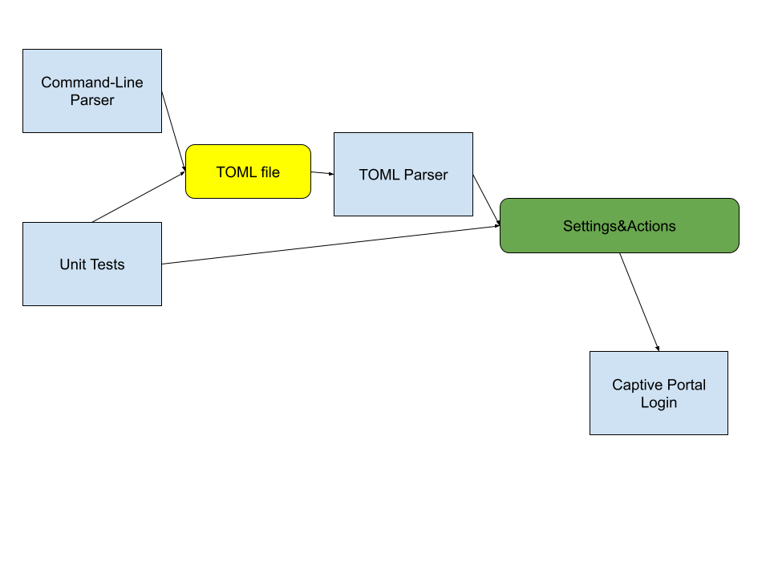

# Headless Capture Portal
## Architecture

* Major Classes:
    * `WebLogin`: Attempts to log into captive portal given a set of settings and actions
    * `SettingsAndActions`: Named tuple.
        1. First Element: Dictionary of Settings
        2. Second Element: List of actions
    * `LoginParser`: Takes a toml file path, reads a toml file from the given path, and creates a Ingest NamedTuple containing settings and actions.
    * `Config`: Takes a toml file path, reads a toml file from the given path, and creates a Ingest NamedTuple containing Configuration information
    * `KeyManager`: Manages keys from the current operating systems keyring.
    * `CLIintake`: Reads command line flags from user and returns toml file.
    * Unit Tests: pytest files excercising objects above

### Current Login File Specification:

## Network Configuration

- **SSID** (`SSID`): 
  - Specifies the SSID of the WiFi network.
  - Note: An error will occur and you will fail to connect if the SSID does not match this value when used in a single login.
  - Purpose: to add more specificity to a network login file for the purpose of 
    - Safety: Will be used in the checking of the validity of a capture portal for a given capture portal file in single-file AKA. `default` mode
    - Automation: When used with the `-A` or Auto flag, this will prevent a mistaken attempt at authentication with the given login file. 
  - Example: `SSID="examplewifi"`

- **URL** (`URL`):
  - Overrides the default starting URL for the capture portal. 
    - Note: if the URL does not match then 
  - Important: This is **NECESSARY** FOR:
    -  Keyring functionality
    - Automatic Login/Detection/Authentication mode. Without a specified URL the file will be IGNORED any time you use the `-A`, or `--Auto` flags. 
  - Example: `URL="https://example.com"`

- **IP Address** (`IP`):
  - Defines the IP address of the Capture Portal.
  - Purpose: to Add more specificity/security to the login attempt, This is important for 
  - Example: `IP="1.0.0.1"`

## Actions Configuration

### Click Actions

- **General Click**:
  - Action: `click`
  - Description: Clicks on elements specified by ID, XPath, name, or type.
  - ID: Supports regular expressions. Unique identifier.
    - Example: `id="example"`
  - XPath: Targets elements using their XPath.
    - Example: `x-path="/html/body/div/div/main/div/p[81]"`
  - Name: Targets elements by their name attribute on the webpage.
    - Example: `name="examplename"`
  - Type: Targets elements by their type attribute.
    - Example: `type="checkbox"`

### Wait Action

- **Wait**:
  - Action: `wait`
  - Description: Pauses the execution for a specified number of seconds before proceeding.
  - Duration: Time in seconds.
  - Example: `wait=30`

### Text Input Actions

- **Text Input**:
  - Action: `text`
  - Description: Enters text into a field. If `value` is not specified, the user will be prompted.
  - Name: The name attribute of the input field.
  - Value: The text to enter. Optional.
    - Example: `name="name", value="examplestringEGUserName"`

#### Secure Text Entry
- **Password Input**:
  - Action: `text`
  - Description: Utilizes the operating system's keyring to securely store and access passwords.
  - Name: `password`
  - Keyring Configuration:
    - Supported backends include: SecretService, KWallet, Windows Vault, macOS Keyring, libsecret, and Bitwarden.
    - The format for keyring values is `[username, *keyring-service]`.
        - \*\*Valid keyring-service name strings are `secretservice`, `kwallet`, `windows`, `macos`, `libsecret`, and `bitwarden`
    - During initialization, if `-R` is passed, it allows changing the set keyring password.
  - Example: `keyring=["YourUserName"]`

### Navigation Actions

- **Move Action**:
  - Action: `move`
  - Description: Navigates to a new page specified by href or ID.
  - Examples:
    - `href="href_url"` (navigates to a page by URL)
    - `id="ID"` (navigates to a page by the element ID)

## Important Notes

- <span style="color: red; font-weight: bold; background-color: black;">It is highly recommended NOT to store passwords in plaintext. Use the keyring options provided for secure password management.</span>
- Ensure that your configuration aligns with the network and operational requirements specified in this document.


#### FOR DEVELOPERS
* Environment Setup:
    * use anaconda \\ disclaimer we are not affiliated with Anaconda in any way.
        1. go to <https://docs.anaconda.com/free/miniconda/>  And install it.
        2. make sure to add conda to your path when you are in the install process.
        3. setup a conda environment and with it use the commands 
            ```
            conda create -n captrportal
            conda activate captrportal
            conda install python
            pip install -r requirements.txt
            ```

#### ROADMAP:
##### FOR  1.0 (First Release)
1. [x] ~~Define a TOML format to define per session actions and settings~~
2. [x] ~~Create a Parser to digest the Defined TOML structure~~
3. [x] ~~Define a safe way to store and process passwords~~
4. [ ] Define a module that verifies that a capture portal actually exists on the network and that it meets the specifications defined in the `Login` files.
5. [x] ~~Define an extensible configuration file format~~
6. [ ] Finish "Quick" frontend (all the commands that cause an immediate action)
7. [ ] Setup Unit Tests 
8. [ ] Develop Modular and Actionable Network Portion of Backend using requests that will take commands from the frontend. HOWEVER ensure that we are creating a good api that can be expanded on by additional installable packages/modules. (i.e [Playwrite](https://playwright.dev/python/docs/intro)) 
##### FOR 2.0
9. [ ] Add Playwrite Support
10. [ ] Create a Intuitive TUI that will guide a user in creating a TOML Login file for a given network. 
##### FAR FUTURE
11. [ ] Port portions of program to GOLANG/RUST????
